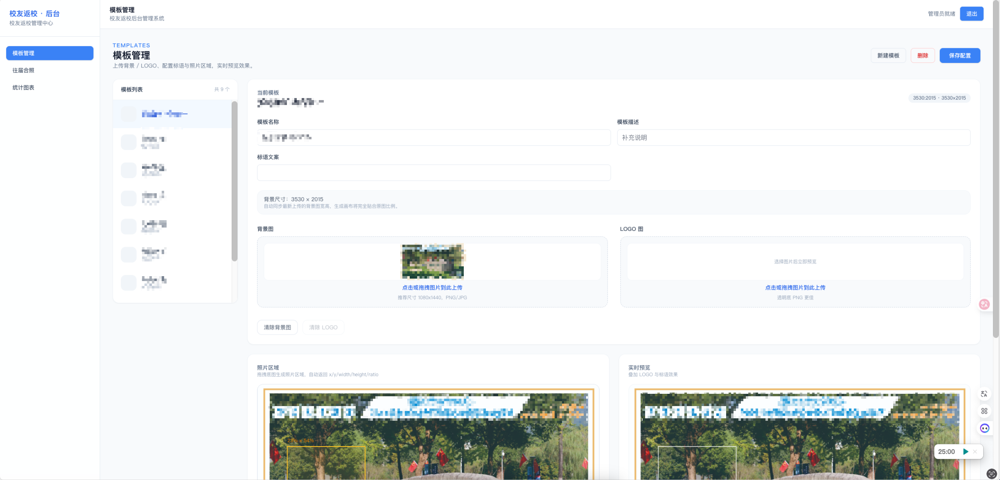
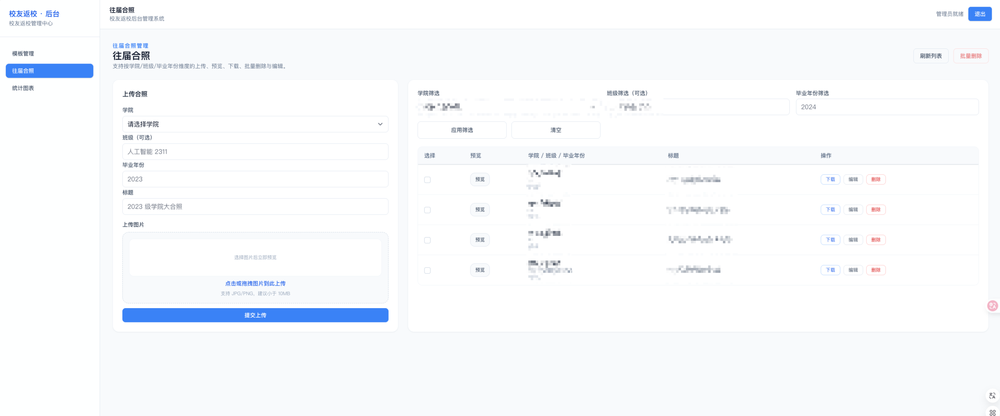
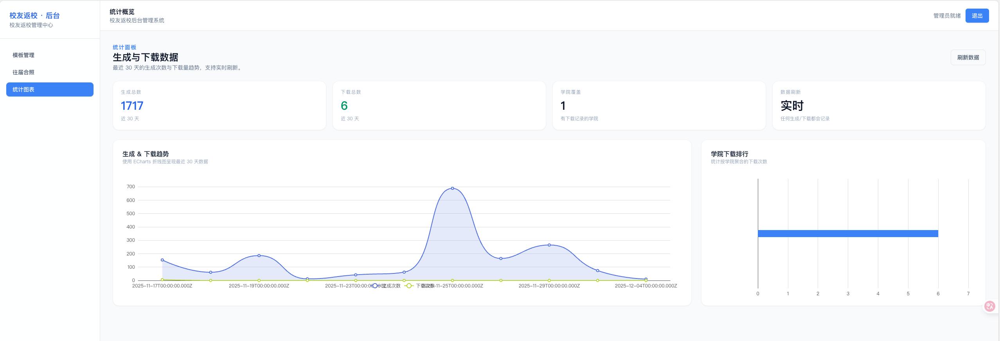
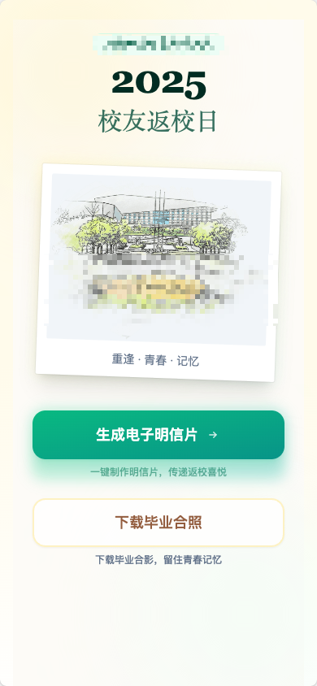
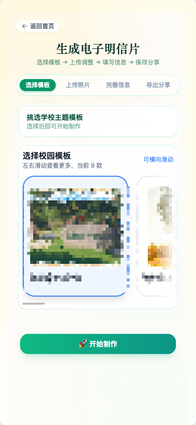
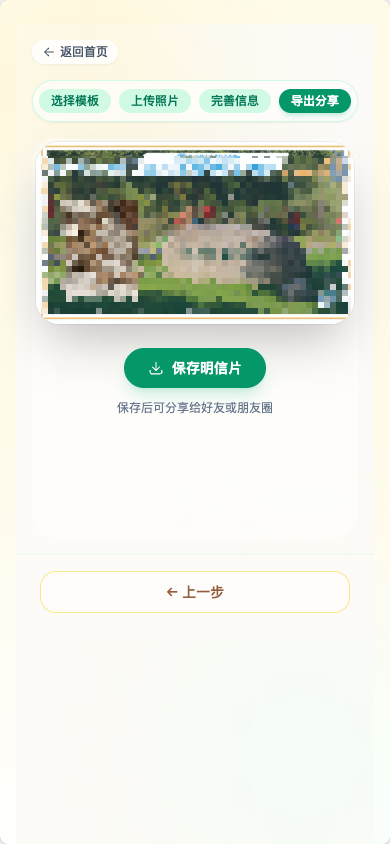
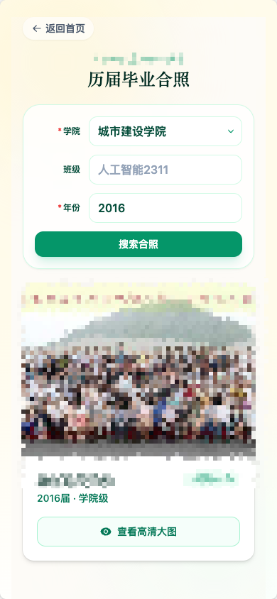

# Friends（老友记）
>
> 模板化明信片生成 & 合照下载平台（H5 + Admin + API）

[English](README.en.md) | [中文](README.md)

一个基于 Vue3 + Vite 前端、Express + MySQL 后端的全栈项目，用于在线配置明信片模板、生成个人合成图、管理/下载往届合照，并可用 Docker 一键跑起来。

## 🧭 结构总览

```
AlumniPostcards
├─ frontend/        # H5：模板选择、上传/裁剪、信息填写、生成下载
├─ admin/           # 管理端：登录、模板/合照/统计可视化
├─ backend/         # API：认证、模板/合照 CRUD、统计、上传
├─ docker/          # Nginx 反代 + 前后端镜像 Dockerfile
├─ scripts/         # sync-env.mjs 同步 VITE_* 到前后端
├─ docker-compose.yml
```

### 🛠️ 技术栈

- 前端 / 管理端：Vite 7、Vue 3.5、TypeScript、Pinia、Vue Router、TailwindCSS、Axios、ECharts、html2canvas。
- 后端：Express 5、TypeScript、MySQL2、Multer、Sharp、JWT、Helmet、Morgan；可切换本地磁盘或 OSS（阿里云）存储。
- 部署：Docker Compose（MySQL + Backend + Nginx 静态站点），Nginx 统一代理 `/api`、`/uploads`。

### ✨ 核心能力

- **模板管理**（Admin）：背景/LOGO 上传，标语编辑，框选照片区域（1:1/3:4/4:3/16:9/9:16），四角 LOGO 位置，实时预览并持久化 `photoArea`、`logo_position`。
- **合照管理**（Admin/H5）：按学院/年份/班级上传、筛选、预览、下载/复制链接；大图自动生成/调用小图预览，支持远程 URL（OSS）。
- **H5 生成流程**：步骤化“选模板 → 上传/调整 → 填写信息 → 预览下载”，模板横向滑动，用户照片镂空遮罩不越界、不拉伸，可选边框与欢迎语开关，生成即预览。
- **统计**：`/stats/chart` 展示 30 天生成/下载趋势与学院排行；H5 下载、生成均上报。
- **上传与存储**：Multer 支持自定义目录，`UPLOAD_MAX_SIZE_MB` 默认 50MB；`storageService` 抽象本地/OSS，支持大图压缩与预览图。
- **CORS/静态**：后端基于 `CLIENT_URLS` / `ADMIN_URLS` 白名单，静态 `/uploads` 允许跨源加载，监听 `0.0.0.0` 便于内网调试。

## 🚀 快速开始（本地）

```bash
pnpm install

# 启动后端
pnpm --filter backend dev   # http://localhost:4000/api

# 启动 H5
pnpm --filter frontend dev  # http://localhost:5173

# 启动管理端
pnpm --filter admin dev     # http://localhost:5174
```

先在 `backend/database/schema.sql` 初始化数据库，再创建 `.env`（见下）。

## ⚙️ 环境变量

1) 复制 `.env.example` 为 `.env`，填写 JWT、管理员账号/密码或 hash、数据库、域名、存储、上传上限等。
2) 运行 `node scripts/sync-env.mjs` 将根目录中的 `VITE_*` 同步到 `frontend/.env` 与 `admin/.env`。
3) 推荐保持 `VITE_API_BASE_URL=/api`、`VITE_UPLOAD_BASE_URL=/uploads`，本地由 Vite 代理到后端，生产由 Nginx 反代。
4) 存储：
   - 本地：`STORAGE_DRIVER=local`（默认），`UPLOAD_DIR=backend/uploads`。
   - OSS：`STORAGE_DRIVER=oss`，再填写 `OSS_ACCESS_KEY_ID/SECRET/BUCKET/REGION/OSS_PUBLIC_DOMAIN` 等。

## 🐳 Docker 部署

1) 准备配置  
   - 复制 `.env.example` → `.env`，填写域名、数据库、JWT、上传目录、OSS（可选）。  
   - 若需 Vite 访问同源，保持 `VITE_API_BASE_URL=/api`、`VITE_UPLOAD_BASE_URL=/uploads`。  
   - 运行 `node scripts/sync-env.mjs` 让前/后台共享同一 VITE 配置。

2) 构建与启动  

```bash
docker compose build          # 构建 backend + web（Nginx）镜像
docker compose up -d          # 依次启动 mysql / backend / web
```

- `mysql`：自动创建数据库/用户（ENV 可覆盖），数据卷 `mysql_data` 持久化。
- `backend`：读取 `.env`，CORS 白名单取 `CLIENT_URLS/ADMIN_URLS`，挂载上传卷 `uploads`。
- `web`：Nginx 托管打包后的前/后台，`/api`、`/uploads` 反代到 `backend:4000`。

3) 访问与验证  
   - H5 默认 `http://localhost`，后台 `http://localhost/admin`（可在 `docker/nginx.conf` 调整）。  
   - 上传目录与数据库分别持久化在 `uploads`、`mysql_data` 卷。  
   - 如需 HTTPS，可在宿主机用 Caddy/Traefik/Certbot，或修改 `docker/nginx.conf` 监听 443 并挂载证书。

4) 调优与运维  
   - 上传上限：`UPLOAD_MAX_SIZE_MB`（同时注意 Nginx `client_max_body_size`）。  
   - 备份：定期打包 `uploads` 与 `mysql_data`；线上使用对象存储可减少静态卷压力。  
   - 域名：在 `docker/nginx.conf` 调整 `server_name`；后端 CORS 需同步 `CLIENT_URLS/ADMIN_URLS`。

## 📸 项目截图

### 后台（Admin）

<table>
  <tr>
    <td align="center"><br/>模板管理</td>
    <td align="center"><br/>合照管理</td>
    <td align="center"><br/>统计数据</td>
  </tr>
</table>

### H5 客户端

<table>
  <tr>
    <td align="center"><br/>步骤 1</td>
    <td align="center"><br/>步骤 2</td>
    <td align="center"><br/>步骤 3</td>
    <td align="center"><br/>合照检索</td>
  </tr>
</table>
